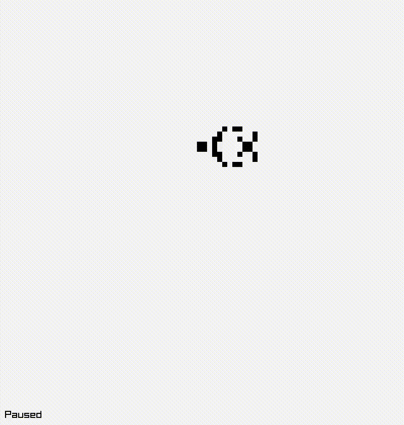

# living-cells - Conway's Game of Life implementation in C



### Install/Build:

- To build, run `make`.
- To install, run `sudo make install`.

### Usage:

```sh
living-cells
```

### Controls:

- Mouse click to toggle the state of a cell.
- Press the `Space` key to start/stop the simulation.
- Press the `R` key to randomize the initial state of the cells.
- Press the `S` key to step the simulation forward one generation.
- Press the `C` key to clear the grid.

### License:

```
This program is free software.
It is licensed under the GNU GPL version 3 or later.
That means you are free to use this program for any purpose;
free to study and modify this program to suit your needs;
and free to share this program or your modifications with anyone.
If you share this program or your modifications
you must grant the recipients the same freedoms.
To be more specific: you must share the source code under the same license.
For details see https://www.gnu.org/licenses/gpl-3.0.html
```
